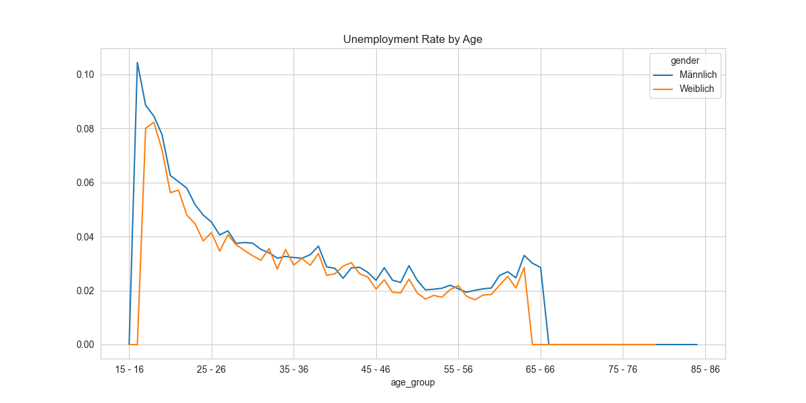
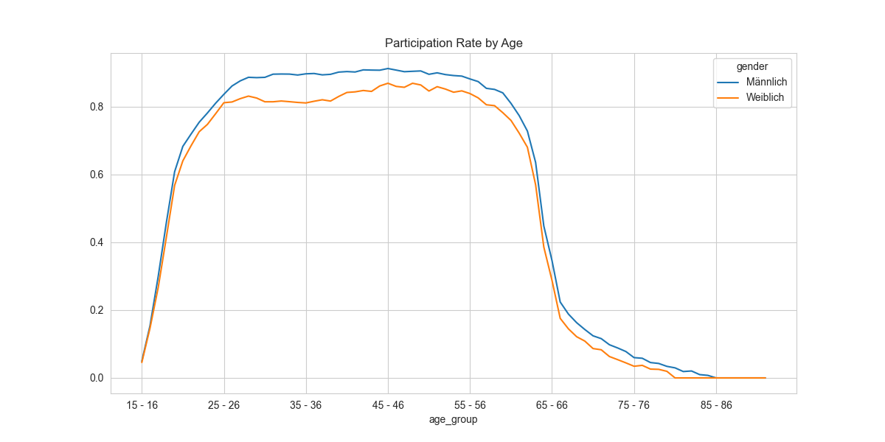
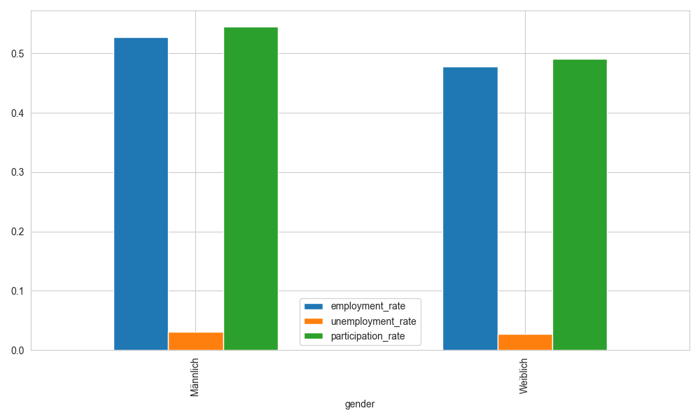

# Labor Market Analysis in Germany (Microcensus 2023)

## Project Overview
This project analyzes labor market patterns in Germany using data from the Microcensus 2023 dataset.

The analysis focuses on:
- Employment trends across age groups
- Gender differences in labor market participation
- Unemployment patterns over the lifecycle

---

## Dataset
Source: German Federal Statistical Office (Destatis)

The dataset contains aggregated information about:
- Population
- Labor force participation
- Employment and unemployment

---

## Data Cleaning
Several data quality issues were identified and resolved:
- Removal of aggregated age groups (e.g., "15–65")
- Handling duplicated observations caused by Excel structure
- Cleaning inconsistent text formatting
- Revalidating results after cleaning

---

## Key Insights

### Age-Based Analysis
- Employment increases rapidly from early working age and peaks around 45–46
- Participation declines significantly after age 55
- Unemployment is highest at entry-level ages (15–16)

### Gender Analysis
- Males show higher participation and employment rates
- Unemployment rates are similar across genders
- Gender gap is mainly driven by participation differences

---

## Visualizations

### Employment Rate by Age

### Unemployment Rate by Age

### Participation Rate by Age

### Gender Comparison

---

## Tools Used
- Python
- Pandas
- Matplotlib

---

## Project Structure
- `data/` → raw dataset
- `notebooks/` → analysis notebook
- `images/` → visualizations

---

## Author
Yara Shartooh

---

## 🇩🇪 Deutsche Version

## Projektübersicht
Dieses Projekt analysiert Arbeitsmarktstrukturen in Deutschland auf Basis der Mikrozensus-Daten 2023.

Die Analyse konzentriert sich auf:
- Beschäftigungstrends nach Altersgruppen
- Geschlechterunterschiede in der Erwerbsbeteiligung
- Arbeitslosigkeitsmuster im Lebensverlauf

---

## Datensatz
Quelle: Statistisches Bundesamt (Destatis)

Der Datensatz enthält aggregierte Informationen zu:
- Bevölkerung
- Erwerbsbeteiligung
- Beschäftigung und Arbeitslosigkeit

---

## Datenbereinigung
Im Datensatz wurden mehrere Datenqualitätsprobleme identifiziert und behoben:

- Entfernung aggregierter Altersgruppen (z. B. „15–65“)
- Behandlung doppelter Beobachtungen aufgrund der Excel-Struktur
- Bereinigung von Textinkonsistenzen (Leerzeichen, Zeilenumbrüche)
- Überprüfung der Ergebnisse nach der Bereinigung zur Sicherstellung der Genauigkeit

---

## Zentrale Erkenntnisse

### Analyse nach Alter
- Die Beschäftigungsquote steigt ab dem frühen Erwerbsalter stark an und erreicht ihren Höhepunkt etwa im Alter von 45–46 Jahren
- Die Erwerbsbeteiligung sinkt deutlich ab etwa 55 Jahren
- Die Arbeitslosigkeit ist in den jüngsten Altersgruppen (15–16) am höchsten

### Analyse nach Geschlecht
- Männer weisen höhere Erwerbs- und Beschäftigungsquoten auf
- Die Arbeitslosenquote ist zwischen den Geschlechtern nahezu identisch
- Der Unterschied zwischen den Geschlechtern ergibt sich hauptsächlich aus der Erwerbsbeteiligung

---

## Visualisierungen

### Beschäftigungsquote nach Alter

### Arbeitslosenquote nach Alter

### Erwerbsquote nach Alter

### Vergleich nach Geschlecht

---

## Verwendete Tools
- Python
- Pandas
- Matplotlib

---

## Projektstruktur
- `data/` → Rohdaten
- `notebooks/` → Analyse-Notebook
- `images/` → Visualisierungen

---

## Autorin
Yara Shartooh